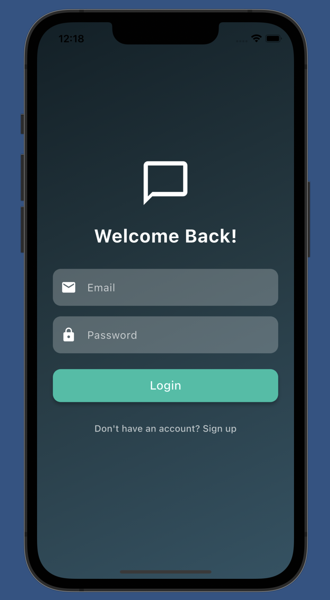
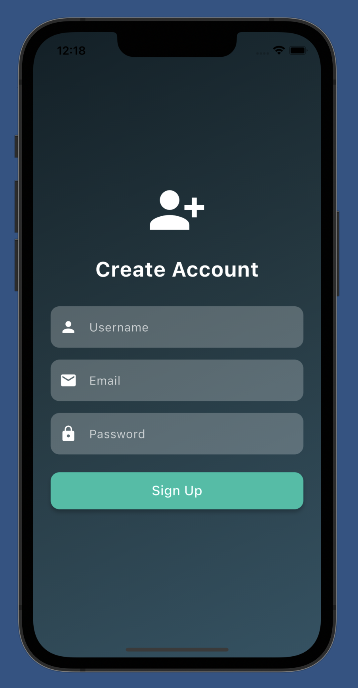
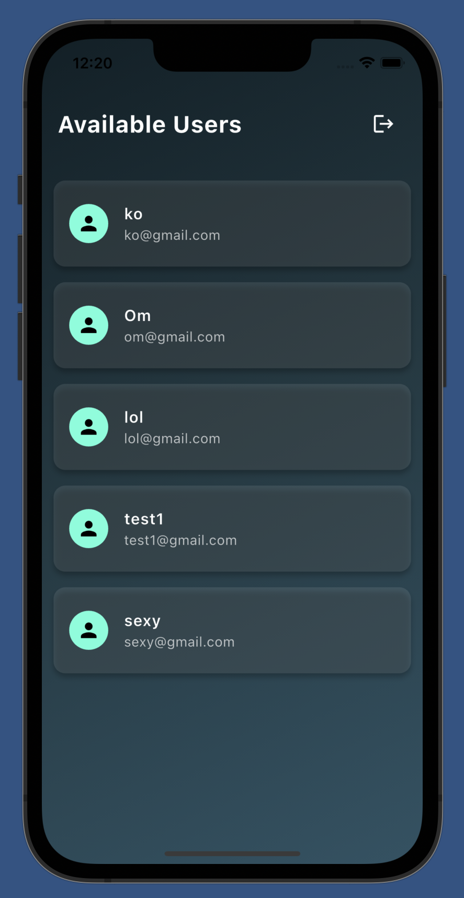
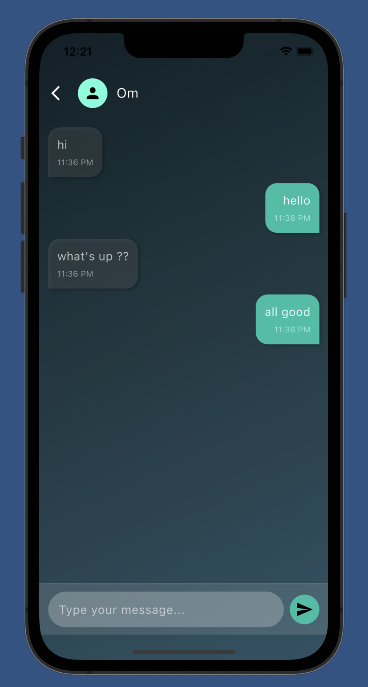

# Chatify 💬
### *Baat Karo Lekin Dil Se :)*

A beautiful, real-time chat application built with Flutter and Firebase that brings people together through seamless messaging.

## ✨ Features

- **Real-time Messaging**: Instant message delivery using Firebase Realtime Database
- **User Authentication**: Secure login and signup with Firebase Auth
- **Beautiful UI**: Modern gradient design with a dark, elegant theme
- **User Discovery**: Browse and chat with all registered users
- **Persistent Sessions**: Stay logged in across app restarts
- **Message Timestamps**: See when messages were sent with formatted time
- **Responsive Design**: Optimized for different screen sizes

## 🚀 Screenshots

<!-- Add your 4 screenshots here -->
| Login Screen | Signup Screen | Home Screen | Chat Screen |
|:------------:|:-------------:|:-----------:|:-----------:|
|  |  |  |  |

## 🛠️ Tech Stack

- **Frontend**: Flutter (Dart)
- **Backend**: Firebase
    - Firebase Authentication
    - Firebase Realtime Database
- **State Management**: StatefulWidget
- **Local Storage**: SharedPreferences
- **Date Formatting**: intl package

## 📱 Architecture

```
lib/
├── models/
│   ├── chat_model.dart      # Chat message data model
│   └── user_model.dart      # User data model
├── screens/
│   ├── login_screen.dart    # Authentication screen
│   ├── signup_screen.dart   # User registration screen
│   ├── home_screen.dart     # Users list screen
│   └── chat_screen.dart     # Real-time chat interface
├── services/
│   └── firebase_options.dart # Firebase configuration
└── main.dart                # App entry point
```

## 🔧 Installation & Setup

### Prerequisites
- Flutter SDK (>=3.0.0)
- Dart SDK
- Firebase project setup
- Android Studio / VS Code

### Step 1: Clone the Repository
```bash
git clone https://github.com/yourusername/chatify.git
cd chatify
```

### Step 2: Install Dependencies
```bash
flutter pub get
```

### Step 3: Firebase Setup
1. Create a new Firebase project at [Firebase Console](https://console.firebase.google.com/)
2. Enable Authentication (Email/Password)
3. Enable Realtime Database
4. Add your Android/iOS app to the project
5. Download `google-services.json` (Android) or `GoogleService-Info.plist` (iOS)
6. Place the configuration files in the appropriate directories

### Step 4: Configure Firebase Options
Update `lib/services/firebase_options.dart` with your Firebase project credentials:
```dart
static const FirebaseOptions android = FirebaseOptions(
  apiKey: 'your-api-key',
  appId: 'your-app-id',
  messagingSenderId: 'your-sender-id',
  projectId: 'your-project-id',
  storageBucket: 'your-storage-bucket',
);
```

### Step 5: Run the App
```bash
flutter run
```

## 🎯 Usage

1. **Sign Up**: Create a new account with username, email, and password
2. **Login**: Sign in with your credentials
3. **Browse Users**: View all registered users on the home screen
4. **Start Chatting**: Tap on any user to begin a conversation
5. **Real-time Messaging**: Send and receive messages instantly
6. **Logout**: Use the logout button to sign out securely

## 🔥 Key Features Breakdown

### Authentication System
- Secure Firebase Authentication
- Form validation and error handling
- Persistent login sessions using SharedPreferences

### Real-time Chat
- Bidirectional message sync
- Message timestamps with 12-hour format
- Elegant message bubbles with sender/receiver distinction
- Auto-scroll to latest messages

### User Interface
- Stunning gradient backgrounds
- Teal accent color scheme
- Responsive design elements
- Smooth animations and transitions

## 📊 Database Structure

### Users Collection
```json
{
  "users": {
    "userId": {
      "uid": "user_unique_id",
      "email": "user@example.com",
      "username": "display_name"
    }
  }
}
```

### Chats Collection
```json
{
  "chats": {
    "senderId-receiverId": {
      "timestamp": {
        "senderId": "sender_uid",
        "receiverId": "receiver_uid",
        "message": "message_text",
        "timestamp": "milliseconds_since_epoch"
      }
    }
  }
}
```

---

<div align="center">
  <p><strong>Made with ❤️ and Flutter</strong></p>
  <p><em>Baat Karo Lekin Dil Se :)</em></p>
</div>